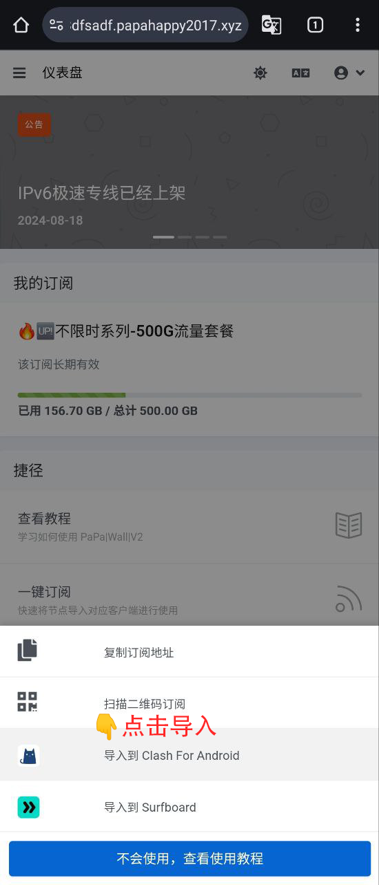
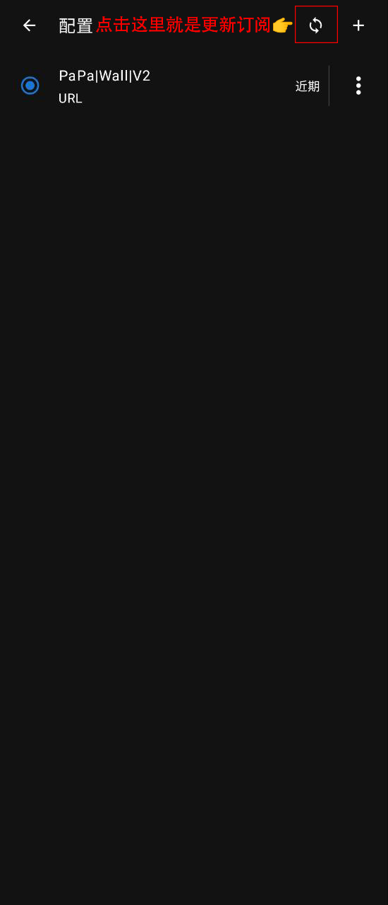

# Clash 教程{ width="40" }
---

[联系客服](javascript:void(0);){: .md-button .md-button--primary #contact-support }

---

### 1️⃣:首先下载并安装客户端
!!! tip "温馨提示"
    
    客户端不会经常更新了,为了保证安全性,请确保下载的为下方的客户端 
    
[:material-arrow-down:{ .plane } 点此下载 :material-arrow-down:{ .plane }](https://down.papawall.cc/Clash.apk){ .md-button }[^1] 

---

### 2️⃣:登录官网[^2] 

!!! note "首先你需要注册好账户,购买好相应的订阅套餐(开心就好)"

官网地址1 [https://papawall.pro](https://papawall.pro)

官网地址2 [https://papawall.lol](https://papawall.lol)

如遇打不开,请联系客服获取最新地址
    
---

### 3️⃣:软件的配置
!!! note "安装好软件以后我们回到官网,添加订阅文件."
    打开官网 点击一键订阅----导入到Clash For Android
<figure markdown="span">
{ width="430" }
</figure>

---

!!! note "点击保存按钮"
<figure markdown="span">
{ width="430" }
</figure>

---

!!! note "保存好以后选择订阅文件"
<figure markdown="span">
{ width="430" }
</figure>

---

!!! note "选中为实心蓝色,然后我们返回到首页"
<figure markdown="span">
{ width="430" }
</figure>

---

!!! note "把已停止点击一下变为运行中,然后我们就可以去选择节点了."
<figure markdown="span">
{ width="430" }
</figure>

---

!!! note "选择一个适合你的节点"
<figure markdown="span">
{ width="430" }
</figure>

---

!!! note "我们就可以开始出国学习资料了."
<figure markdown="span">
{ width="430" }
</figure>

---

!!! warning "更新订阅,很重要,敲黑板!"
    在配置选项里面 刷新按钮 更新的时候请先停止代理
<figure markdown="span">
{ width="480" }
  <figcaption>订阅更新</figcaption>
</figure>

---

## ❓连不上怎么办
    首先检查一下流量以及账户到期时间
    检查一下节点是否为超时,更换节点
    检查一下dns是否更改为
    IPv4 DNS
      - 119.29.29.29           (腾讯公共DNS)
      - 8.8.8.8                (谷歌公共DNS)
    IPv6 DNS
      - 2400:3200::1           (阿里公共DNS)
      - 2001:4860:4860::8888   (谷歌公共DNS)
!!! bug "90%的问题基本都可以解决,请仔细检查呀 如果解决不了请联系客服"

[^1]: 此客户端不会经常更新,属于稳定版本,放心使用.
[^2]: 官网地址 [https://papawall.pro](https://papawall.pro)