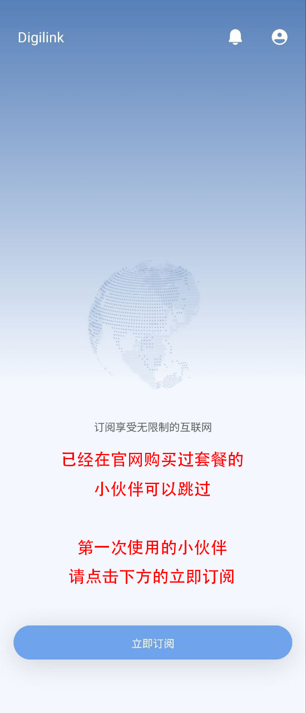
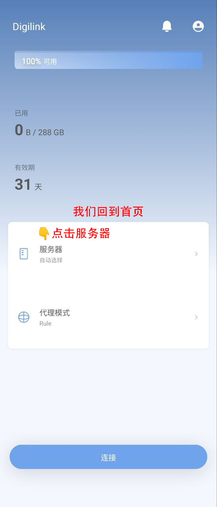
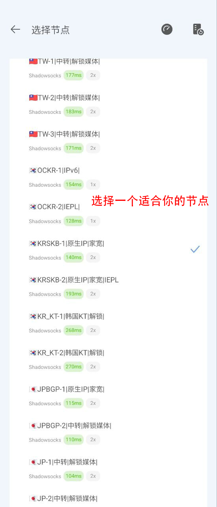

# DigiLink 教程  { width="40" }
---

[右下角↘️联系客服 :fontawesome-solid-user-plus:{ .plane }](javascript:void(0);){: .md-button .md-button--primary #contact-support }

---

### 1️⃣:首先下载客户端
!!! tip "温馨提示"
    
    最简单的客户端,只需要在软件里面注册 登录 购买好订阅即可使用.
    
[:material-arrow-down:{ .plane } 点此下载 :material-arrow-down:{ .plane }](https://down.papawall.cc/Digilink_1.3.10.apk){ .md-button }[^1] 

### 2️⃣:官网地址:

官网地址1 [https://papawall.pro](https://papawall.pro)

官网地址2 [https://papawall.lol](https://papawall.lol)[^2] 

如遇打不开,请联系客服获取最新地址

---

### 3️⃣:软件设置教程

!!! note "安装好以后我们直接打开软件"
    软件内可以注册账户,有账户的小伙伴直接登录即可.
<figure markdown="span">
{ width="350" }
  <figcaption></figcaption>
</figure> 

---

!!! note "点击立即订阅,已经有购买过的小伙伴可以跳过直接选择服务器"
<figure markdown="span">
{ width="350" }
</figure>

---

!!! note "选择一个你喜欢的套餐(开心就好)"
<figure markdown="span">
{ width="350" }
</figure>

---

!!! note "然后我们退出app,重新打开,点击右上角的头像,就可以看到购买的套餐啦."
<figure markdown="span">
{ width="350" }
</figure>

---

!!! note "接着我们回到首页点击服务器,选择节点."
<figure markdown="span">
{ width="350" }
</figure>

---

!!! note "选择一个适合你的节点,例如物理位置,延迟,解锁流媒体等."
<figure markdown="span">
{ width="350" }
</figure>

---

!!! note "然后我们返回,点击连接,大功告成."
<figure markdown="span">
{ width="350" }
</figure>

---

!!! note "我们就可以开始出国学习资料了."
<figure markdown="span">
{ width="350" }
  <figcaption>开始冲浪🏄‍</figcaption>
</figure>

---

## ❓连不上怎么办
    首先检查一下流量以及账户到期时间
    检查一下节点是否为超时,更换节点
    检查一下dns是否更改为
    IPv4 DNS
      - 119.29.29.29           (腾讯公共DNS)
      - 8.8.8.8                (谷歌公共DNS)
    IPv6 DNS
      - 2400:3200::1           (阿里公共DNS)
      - 2001:4860:4860::8888   (谷歌公共DNS)
!!! bug "90%的问题基本都可以解决,请仔细检查呀 如果解决不了请联系客服"

[^1]: 此客户端不会经常更新,属于稳定版本,放心使用.
[^2]: 官网地址 [https://papawall.pro](https://papawall.pro)

[^1]: Digilink的客户端为一体客户端(注册,登录,购买,连接)一般无需更新.
[^2]: 官网地址 [https://papawall.pro](https://papawall.pro)