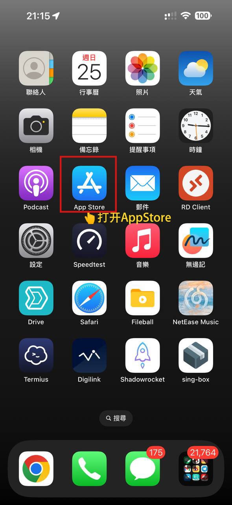
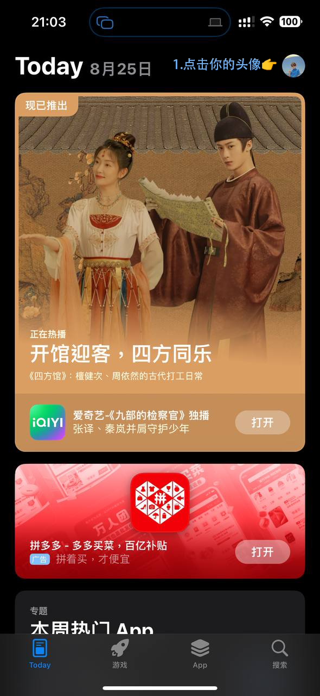
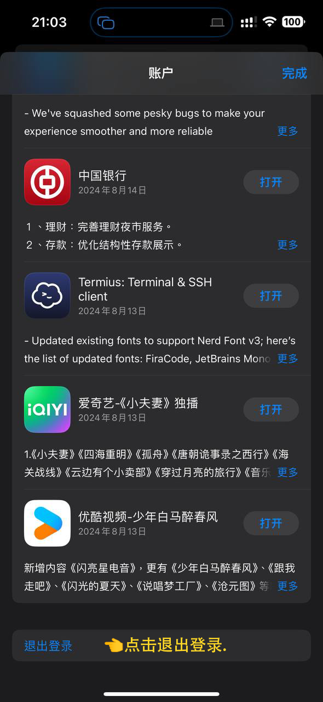
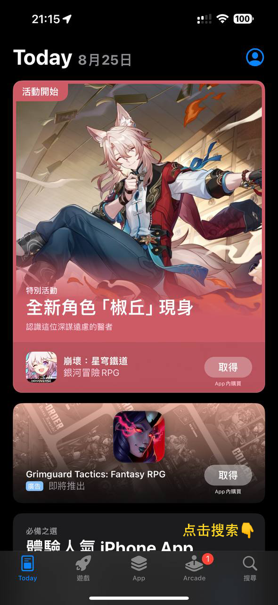
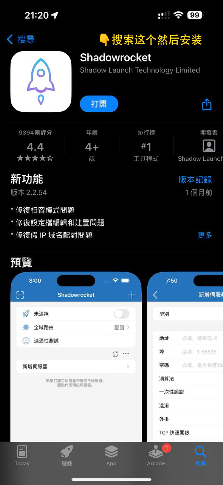
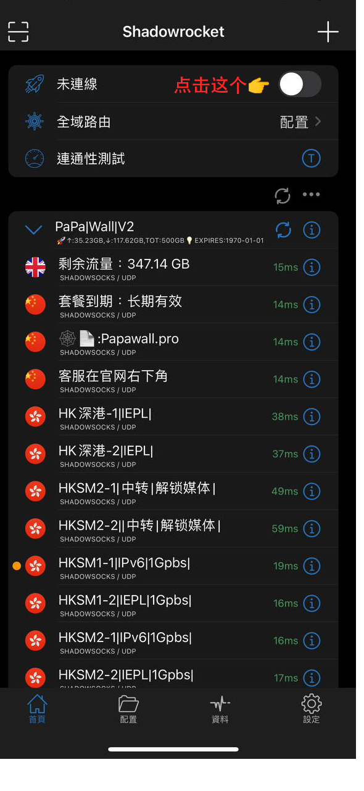
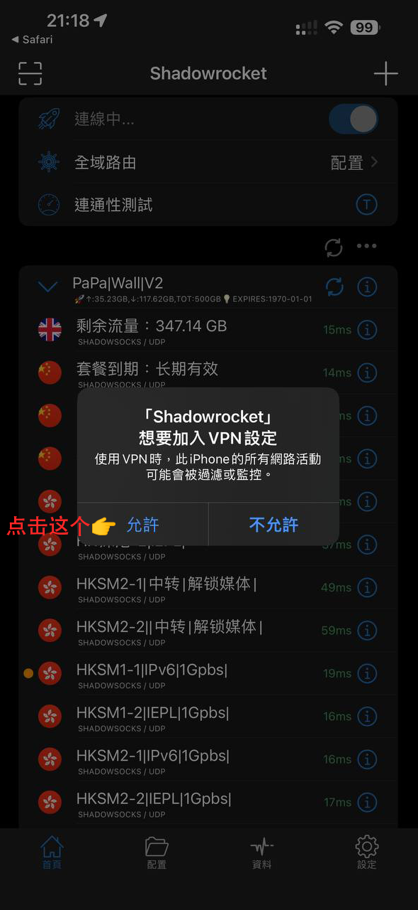
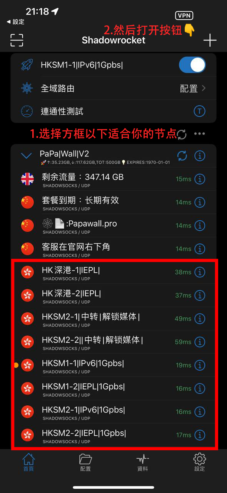
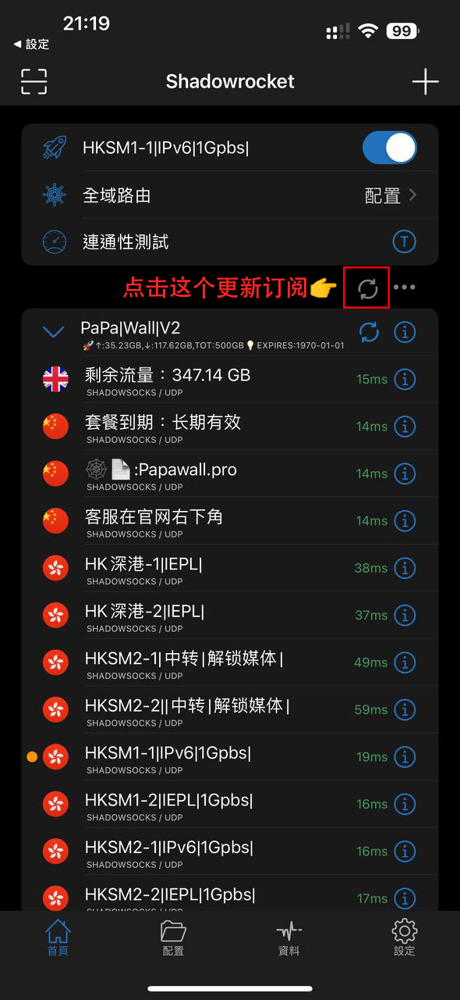

# Shadowrocket 教程{ width="40" }
---

[右下角↘️联系客服 :fontawesome-solid-user-plus:{ .plane }](javascript:void(0);){: .md-button .md-button--primary #contact-support }

---

### 1️⃣:首先需要有一个国外的苹果ID
!!! tip "温馨提示"
    
    需要获取一个国外的苹果id,点击下方链接获取.
    您自己的外区ID也可以,这个app需要付费,我们的ID为购买好的
    
[:material-arrow-down:{ .plane } 点此获取 :material-arrow-down:{ .plane }](https://shop.papawall.cc/buy/1){ .md-button }[^1] 

---

### 2️⃣:登录官网[^2] 

!!! note "首先你需要注册好账户,购买好相应的订阅套餐(开心就好)"

官网地址1 [https://papawall.pro](https://papawall.pro)

官网地址2 [https://papawall.lol](https://papawall.lol)

如遇打不开,请联系客服获取最新地址
    
---

### 3️⃣:登录国外Apple ID
!!! note "准备好苹果ID 去官网把账户登录好,停留在有一键订阅的页面就行 "
---
!!! abstract "打开App Store"
<figure markdown="span">
{ width="360" }
</figure>

---

!!! abstract "点击右上角你的头像"
<figure markdown="span">
{ width="360" }
</figure>

---

!!! abstract "拉到最底部点击退出登录"
<figure markdown="span">
{ width="360" }
</figure>

---

!!! abstract "再回到顶部点击登录"
<figure markdown="span">
{ width="360" }
</figure>

---

!!! abstract "选择第二项"不是" ,然后登录刚刚获取的苹果id"
<figure markdown="span">
{ width="360" }
</figure>

---

!!! abstract "登录好以后点击搜索"
<figure markdown="span">
{ width="360" }
</figure>

---

!!! abstract "搜索"Shadowrocket",点击下载即可"
<figure markdown="span">
{ width="360" }
</figure>

---

!!! abstract "桌面上出现图标,并且打开以后是这样即为下载完成."
<figure markdown="span">
{ width="360" }
</figure>

---
### 4️⃣:配置软件
!!! abstract "回到刚刚登录好的官网,点击一键订阅"
<figure markdown="span">
{ width="360" }
</figure>

---

!!! abstract "点击打开."
<figure markdown="span">
{ width="360" }
</figure>

---

!!! abstract "订阅就添加成功.然后选择打开按钮"
<figure markdown="span">
{ width="360" }
</figure>

---

!!! abstract "点击"允许""
<figure markdown="span">
{ width="360" }
</figure>

---

!!! abstract "点击"好""
<figure markdown="span">
{ width="360" }
</figure>

---

!!! abstract "输入你手机的锁屏密码确认身份"
<figure markdown="span">
{ width="360" }
</figure>

---

!!! abstract "然后在选择适合你的节点,点击按钮 出现顶部字样 即为成功."
<figure markdown="span">
{ width="360" }
</figure>

---

!!! abstract "可以开始网上冲浪拉!🏄"
<figure markdown="span">
{ width="360" }
</figure>

---

!!! warning "更新订阅,很重要,敲黑板!"
<figure markdown="span">
{ width="360" }
</figure>

---

## ❓连不上怎么办
    首先检查一下流量以及账户到期时间
    检查一下节点是否为超时,更换节点
    检查一下dns是否更改为
    IPv4 DNS
      - 119.29.29.29           (腾讯公共DNS)
      - 8.8.8.8                (谷歌公共DNS)
    IPv6 DNS
      - 2400:3200::1           (阿里公共DNS)
      - 2001:4860:4860::8888   (谷歌公共DNS)
!!! bug "90%的问题基本都可以解决,请仔细检查呀 如果解决不了请联系客服"

[^1]: 账号为公共账户,请勿登录iCloud,切记.如果因为登录导致被锁机,我们也会很无奈的啊.
[^2]: 官网地址 [https://papawall.pro](https://papawall.pro)