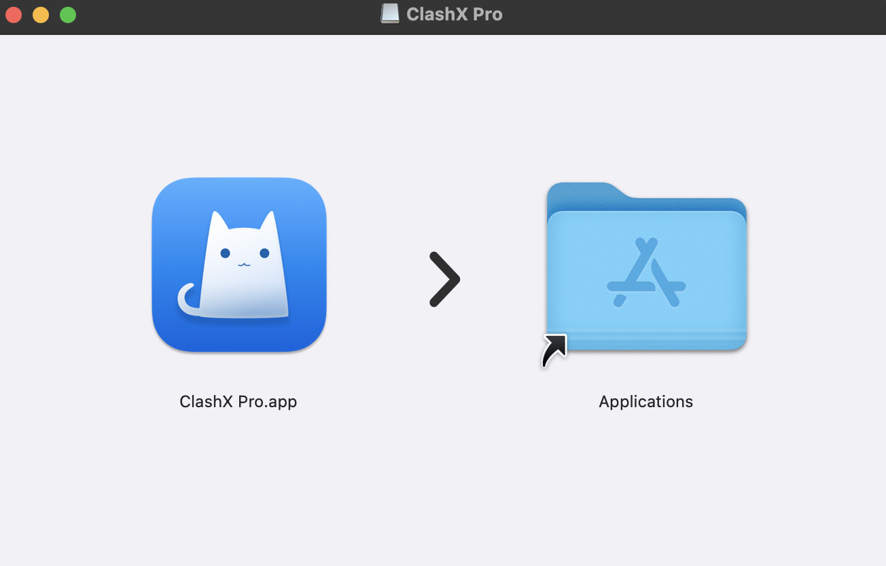
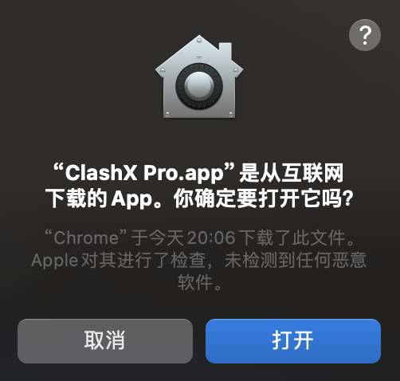
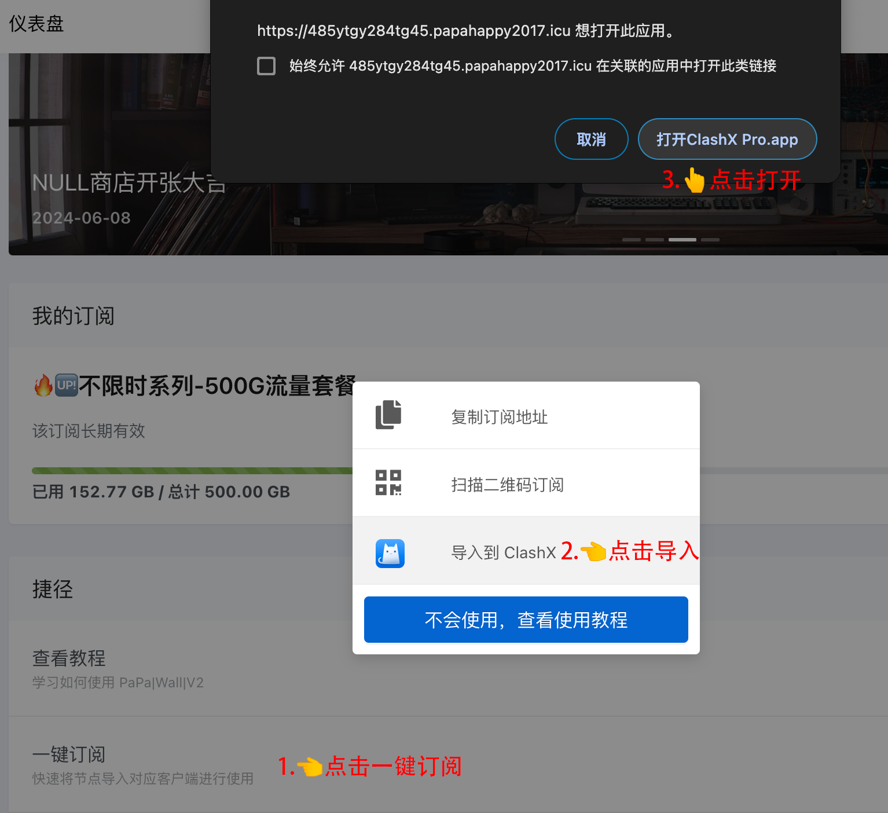
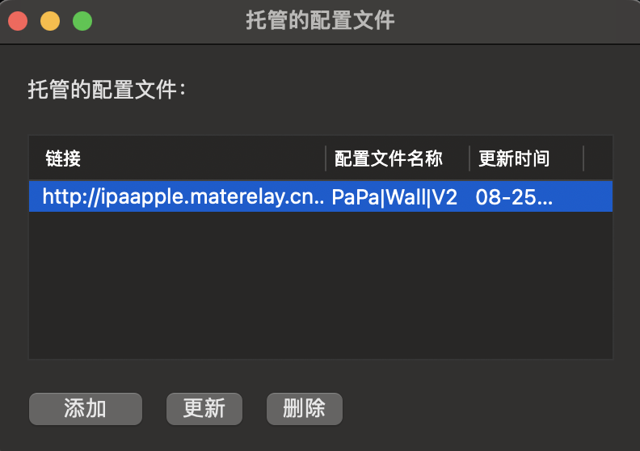
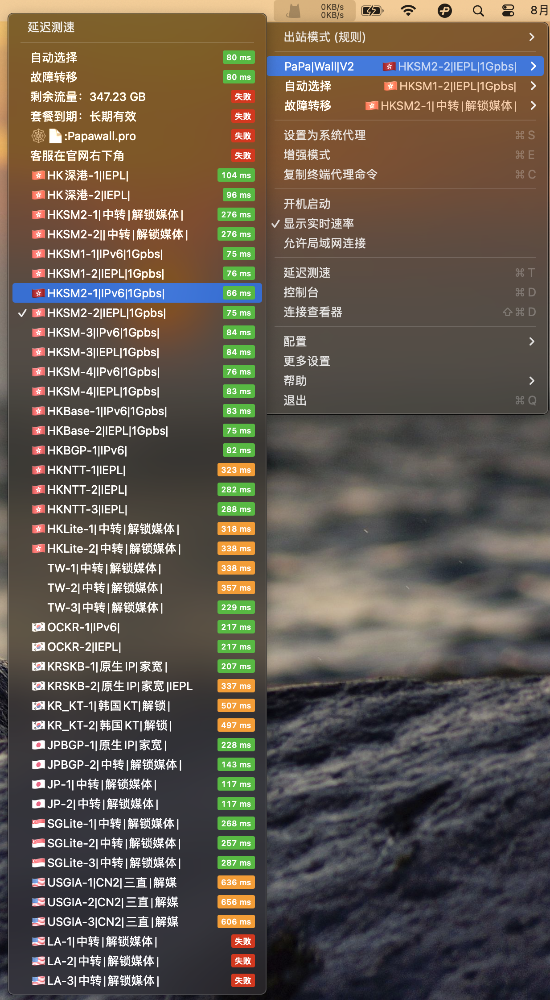
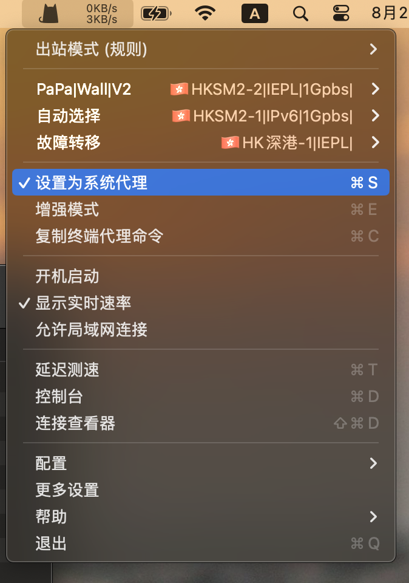

# Clash 教程{ width="40" }
---

[联系客服 :fontawesome-solid-user-plus:{ .plane }](../../chat.html){ .md-button .md-button--primary }

---

### 1️⃣:首先下载客户端
!!! tip "温馨提示"
    
    客户端不会经常更新了,为了保证安全性,请确保下载的为下方的客户端 
    
[:material-arrow-down:{ .plane } 点此下载 :material-arrow-down:{ .plane }](https://154.12.80.60/Clash_Mac.dmg){ .md-button }[^1] 

---

### 2️⃣:登录官网[^2] 

!!! note "首先你需要注册好账户,购买好相应的订阅套餐(开心就好)"

官网地址1 [https://papawall.pro](https://papawall.pro)

官网地址2 [https://papawall.lol](https://papawall.lol)

如遇打不开,请联系客服获取最新地址
    
---

### 3️⃣:软件的安装
!!! warning "由于Mac系统设计时为了安全考虑,未签名的软件无法直接打开,需要手动确认."
    请跟着图片一步一步操作即可.
<figure markdown="span">
{ width="600" }
  <figcaption>先拖放文件至右边文件夹</figcaption>
{ width="280" }
  <figcaption>点击打开</figcaption>
{ width="350" }
  <figcaption>状态栏出现小猫咪图标</figcaption>
</figure>
!!! tip "在状态栏里出现软件图标,软件就安装完毕."

---

### 4️⃣:软件的配置
!!! note "软件使用基本操作也很简单.导入订阅,选择节点,打开设为系统代理,就可以了."
<figure markdown="span">
{ width="700" }
  <figcaption>打开官网,点击一键订阅,然后点击打开ClashX Pro.app</figcaption>
</figure>

---

<figure markdown="span">
{ width="380" }
  <figcaption>点击确定</figcaption>
 </figure>

 ---

!!! abstract "更新时间显示为当前日期就为更新成功"
<figure markdown="span">
{ width="380" }
</figure>

---

!!! abstract "选择一个适合你的节点,例如地理位置,延迟等"
<figure markdown="span"> 
{ width="600" }
</figure>

---

!!! tip "软件的使用"
    节点选择好以后,打开设置为系统代理,即可正常使用拉~
<figure markdown="span">
{ width="380" }
  <figcaption>打开设置为系统代理</figcaption>
</figure>

---

!!! tip "如果出现某些软件无法出国学习资料,请打开增强模式即可.(只打开他一个)"
<figure markdown="span">
{ width="380" }
  <figcaption>某些软件无法使用就打开增强模式即可.</figcaption>
</figure>

---

!!! warning "更新订阅,很重要,敲黑板!"
    在配置选项里面选择托管配置----选择更新即可 快捷键❀+U
<figure markdown="span">
{ width="480" }
  <figcaption>订阅更新</figcaption>
</figure>

---

!!! warning "为了方便大家,建议打开自动更新订阅为每6小时,这样可以无感获取最新节点."
<figure markdown="span">
{ width="600" }
  <figcaption>自动更新订阅</figcaption>
</figure>

---

<figure markdown="span">
{ width="600" }
  <figcaption>可以开始网上冲浪拉!🏄‍</figcaption>
</figure>

---

## ❓连不上怎么办
    首先检查一下流量以及账户到期时间
    检查一下节点是否为超时,更换节点
    检查一下dns是否更改为
    IPv4 DNS
      - 119.29.29.29           (腾讯公共DNS)
      - 8.8.8.8                (谷歌公共DNS)
    IPv6 DNS
      - 2400:3200::1           (阿里公共DNS)
      - 2001:4860:4860::8888   (谷歌公共DNS)
!!! bug "90%的问题基本都可以解决,请仔细检查呀 如果解决不了请联系客服"

[^1]: 此客户端兼容M&Intel处理器
[^2]: 官网地址 [https://papawall.pro](https://papawall.pro)