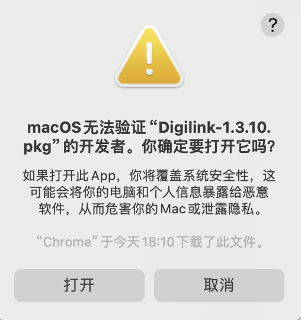

# DigiLink 教程{ width="40" }
---

[右下角↘️联系客服 :fontawesome-solid-user-plus:{ .plane }](javascript:void(0);){: .md-button .md-button--primary #contact-support }

---

### 1️⃣:首先下载客户端
!!! tip "温馨提示"
    
    最简单的客户端,只需要在软件里面注册 登录 购买好订阅即可使用.
    
[:material-arrow-down:{ .plane } M系列处理器点此下载 :material-arrow-down:{ .plane }](https://down.papawall.cc/Digilink_1.3.10-arm64.pkg){ .md-button }
[:material-arrow-down:{ .plane } Intel系列处理器点此下载 :material-arrow-down:{ .plane }](https://down.papawall.cc/Digilink_1.3.10.pkg){ .md-button }[^1] 

---

### 2️⃣:安装客户端
!!! warning "由于Mac系统设计时为了安全考虑,未签名的软件无法直接打开,需要手动确认."
    请跟着图片一步一步操作即可.
<figure markdown="span">
{ width="280" }
  <figcaption>打开安装软件后点击好</figcaption>
{ width="600" }
  <figcaption>打开系统设置,找到隐私与安全性,往下拉,点击仍要打开.</figcaption>
{ width="600" }
  <figcaption>输入你的验证信息,指纹或者密码.</figcaption>
{ width="280" }
  <figcaption>点击打开</figcaption>
{ width="600" }
  <figcaption>一路继续安装到底</figcaption>
{ width="600" }
  <figcaption>点击移到废纸篓,安装包就可以删除了</figcaption>
  <figcaption></figcaption>
</figure>
!!! tip "软件的安装就已经完成.然后去程序坞里面打开Digilink,开始下一步."
---

### 3️⃣:软件的使用
!!! note "安装好客户端以后直接登录,没有账户的注册一下."
<figure markdown="span">
{ width="600" }
  <figcaption>登录你的账户</figcaption>
</figure>

---

!!! note "打开软件进行配置."
    未购买订阅的直接购买好即可

<figure markdown="span">
{ width="600" }
  <figcaption>点击立即订阅</figcaption>
{ width="600" }
  <figcaption>购买你喜欢的订阅套餐</figcaption>
</figure>

---

!!! tip "购买好以后选择一个适合你的节点"

<figure markdown="span">
{ width="600" }
  <figcaption>选择一个适合你的节点</figcaption>
{ width="600" }
  <figcaption></figcaption>
</figure>

---

!!! example "选择好节点后点击连接,就可以出国学习资料啦."

<figure markdown="span">
{ width="600" }
  <figcaption>点击连接</figcaption>
</figure>

---

<figure markdown="span">
{ width="600" }
  <figcaption>可以开始网上冲浪拉!🏄‍</figcaption>
</figure>

---

!!! warning "连接好以后,如果出现有一些软件无法进行学习的情况.请在设置里打开TUN模式即可解决."

<figure markdown="span">
{ width="600" }
  <figcaption>点击连接</figcaption>
</figure>

---

## ❓连不上怎么办
    首先检查一下流量以及账户到期时间
    检查一下节点是否为超时,更换节点
    检查一下dns是否更改为
    IPv4 DNS
      - 119.29.29.29           (腾讯公共DNS)
      - 8.8.8.8                (谷歌公共DNS)
    IPv6 DNS
      - 2400:3200::1           (阿里公共DNS)
      - 2001:4860:4860::8888   (谷歌公共DNS)
!!! bug "90%的问题基本都可以解决,请仔细检查呀 如果解决不了请联系客服"

[^1]: Digilink的客户端为一体客户端(注册,登录,购买,连接)一般无需更新.