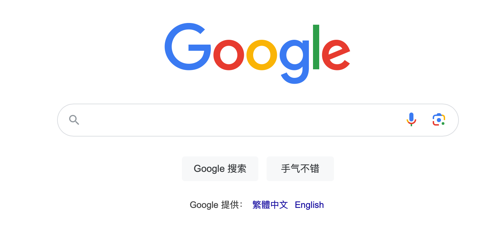

# Mac 教程注意事项

本文阅读时间大约2分钟，共N个操作步骤，熟悉后简单易用，小编强烈推荐！

---

# 01 下载

[点击下载 :octicons-download-16:](Https://baidu.com){ .md-button }

- 下载完成后，双击安装包
- 按住ClashX拖入Applications
- 启动台找到Clash启动（此时屏幕右上方会出现“小猫咪”图标）

!!! 安装帮助程序
    片刻后，系统将提示：安装帮助程序。  
    点击安装即可，此时可以先进入下一个步骤.
    { loading=lazy }

# 02 导入订阅

[用户中心 :fontawesome-solid-user:](Https://baidu.com){ .md-button }

- 登录用户中心
- 点击“一键订阅”
- 点击“导入到ClashX”

!!! 一键订阅
    { loading=lazy }

!!! 导入到ClashX
    { loading=lazy }

!!! 确定并关闭
    { loading=lazy }
    { loading=lazy }
    { loading=lazy }

# 03 开启代理

- 确认配置文件被勾选
- 选择节点（默认自动选择）
- 勾选“设置为系统代理”

!!! 确认配置文件
    { loading=lazy }

!!! 选择节点（无其他需求，默认自动选择）
    { loading=lazy }

!!! 勾选“设置为系统代理”
    { loading=lazy }

# 04 访问谷歌

[google.com](https://google.com)

!!! 访问谷歌是否代理成功
    { loading=lazy }
