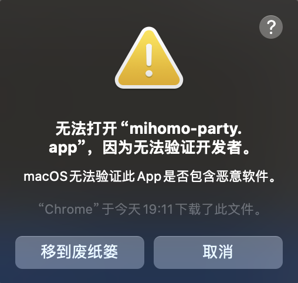
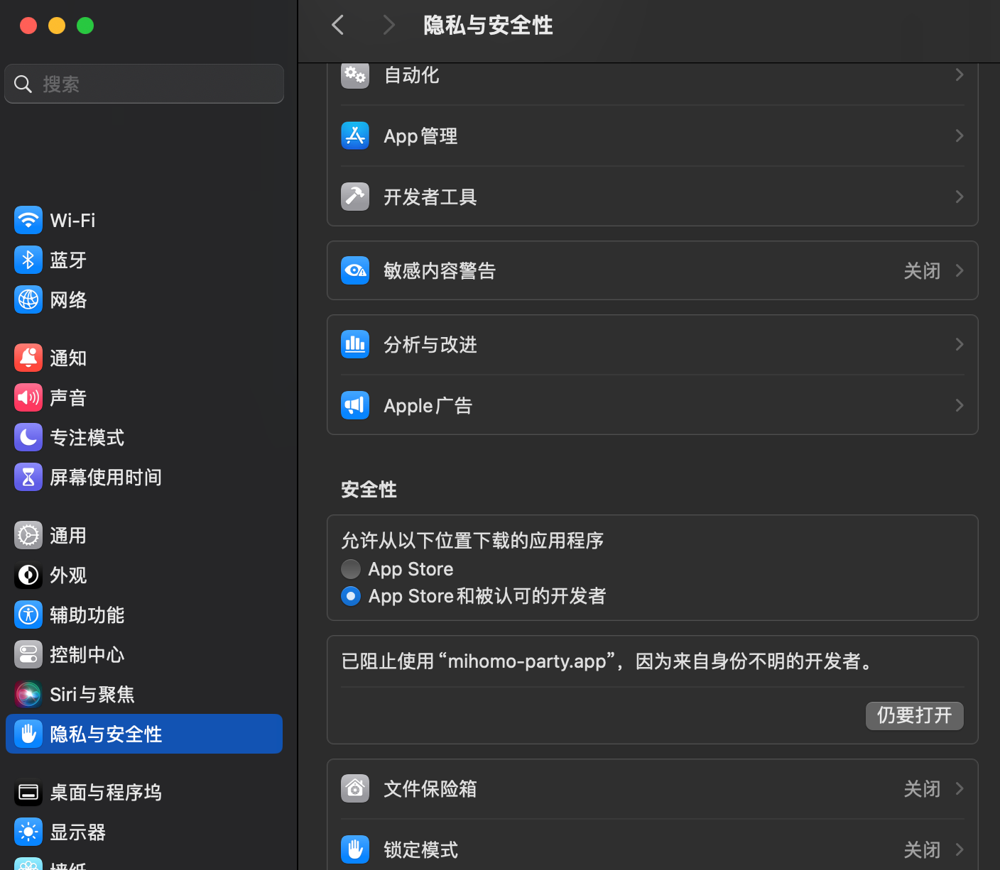
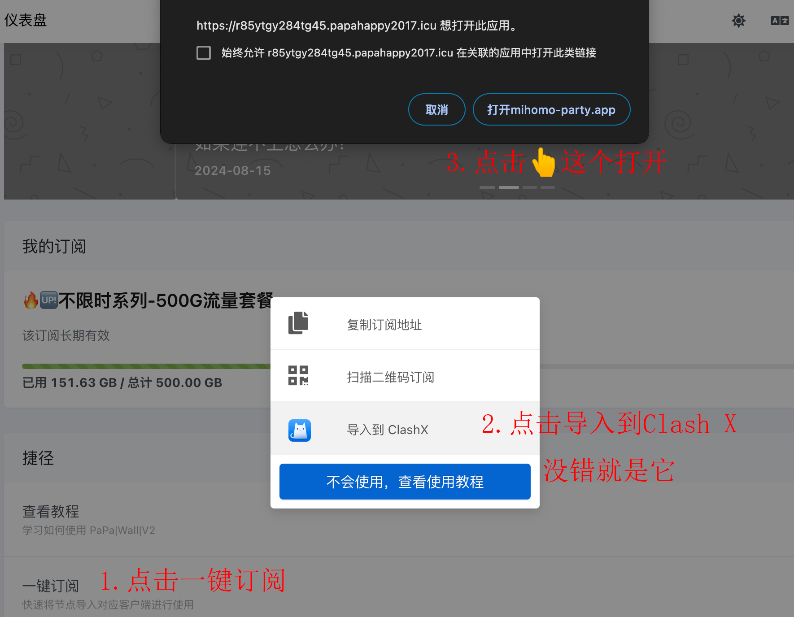
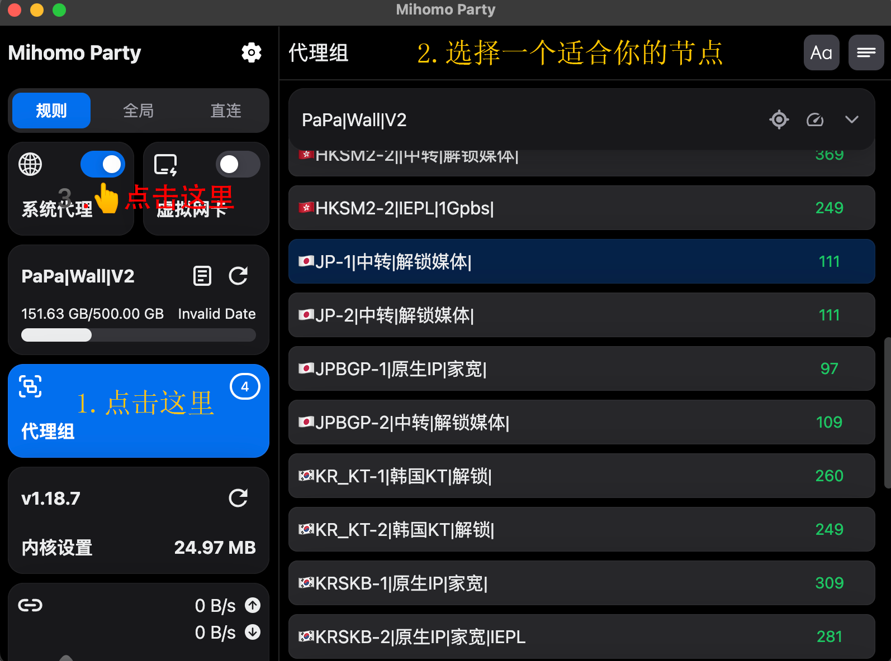
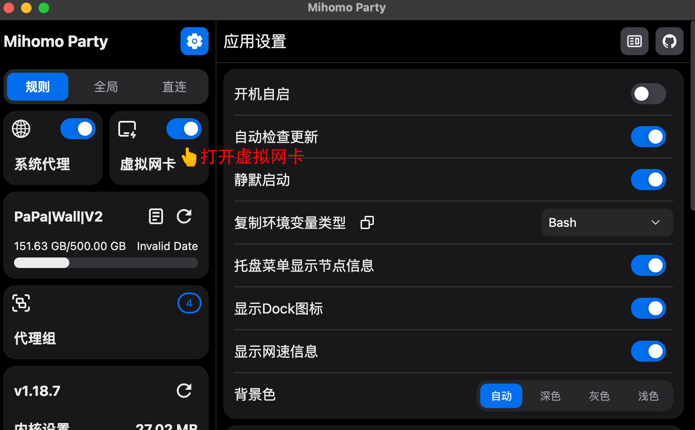

# Mihomo Party教程 { width="50" }
---

[联系客服 :fontawesome-solid-user-plus:{ .plane }](../../chat.html){ .md-button .md-button--primary }

---

### 1️⃣:下载客户端
!!! tip "温馨提示"
    
    此客户端更新频繁,而且可以备份设置到你自己的WebDav 比较方便 与win平台通用.
    
[:material-arrow-down:{ .plane } M系列处理器点此下载 :material-arrow-down:{ .plane }](https://down.papawall.cc/mp_macos-1.5.2-arm64.pkg){ .md-button }
[:material-arrow-down:{ .plane } Intel系列处理器点此下载 :material-arrow-down:{ .plane }](https://down.papawall.cc/mp_macos_1.2.17-x64.dmg){ .md-button }[^1] 

---

### 2️⃣:登录官网[^2] 

!!! note "首先你需要注册好账户,购买好相应的订阅套餐(开心就好)"

官网地址1 [https://papawall.pro](https://papawall.pro)

官网地址2 [https://papawall.lol](https://papawall.lol)

如遇打不开,请联系客服获取最新地址
    
---

### 3️⃣:软件的安装
!!! warning "由于Mac系统设计时为了安全考虑,未签名的软件无法直接打开,需要手动确认."
    请跟着图片一步一步操作即可.
<figure markdown="span">
{ width="600" }
  <figcaption>先拖放文件至右边文件夹</figcaption>
{ width="280" }
  <figcaption>点击取消</figcaption>
{ width="700" }
  <figcaption>打开系统设置,找到隐私与安全性,往下拉,点击仍要打开.</figcaption>
{ width="600" }
  <figcaption>输入你的验证信息,指纹或者密码.</figcaption>
{ width="280" }
  <figcaption>点击打开.</figcaption>
{ width="600" }
  <figcaption>打开官网,登录好,导入订阅文件到软件里</figcaption>
{ width="600" }
  <figcaption>导入完成就是这样</figcaption>
</figure>
!!! tip "这样软件就基本安装完毕."
---

### 3️⃣:软件的使用
!!! note "软件使用基本操作也很简单.选择节点,打开系统代理,就可以了."
<figure markdown="span">
{ width="600" }
  <figcaption>打开系统代理就可以拉~</figcaption>
</figure>
<figure markdown="span">
{ width="300" }
  <figcaption>顶部状态栏也可以右击打开菜单.</figcaption>
</figure>

---

<figure markdown="span">
{ width="600" }
  <figcaption>可以开始网上冲浪拉!🏄‍</figcaption>
</figure>

---

!!! warning "连接好以后,如果出现有一些软件无法进行学习的情况.请在设置里打开虚拟网卡即可解决."
<figure markdown="span">
{ width="600" }
  <figcaption>打开虚拟网卡即可.</figcaption>
</figure>

## ❓连不上怎么办
    首先检查一下流量以及账户到期时间
    检查一下节点是否为超时,更换节点
    检查一下dns是否更改为
    IPv4 DNS
      - 119.29.29.29           (腾讯公共DNS)
      - 8.8.8.8                (谷歌公共DNS)
    IPv6 DNS
      - 2400:3200::1           (阿里公共DNS)
      - 2001:4860:4860::8888   (谷歌公共DNS)
!!! bug "90%的问题基本都可以解决,请仔细检查呀 如果解决不了请联系客服"

[^1]: 截止发稿为止客户端版本号为1.0.4 预计安装后会提示更新,直接更新即可.
[^2]: 官网地址 [https://papawall.pro](https://papawall.pro)