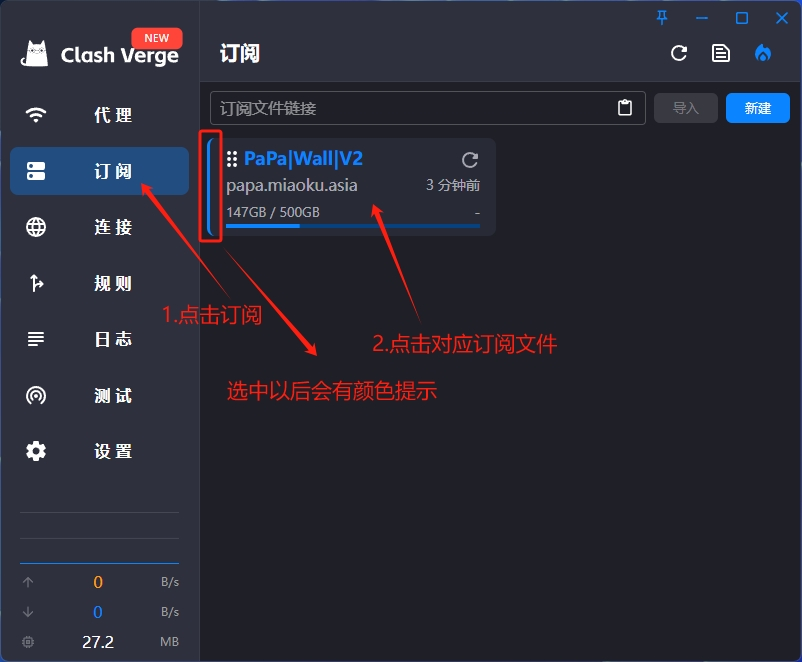
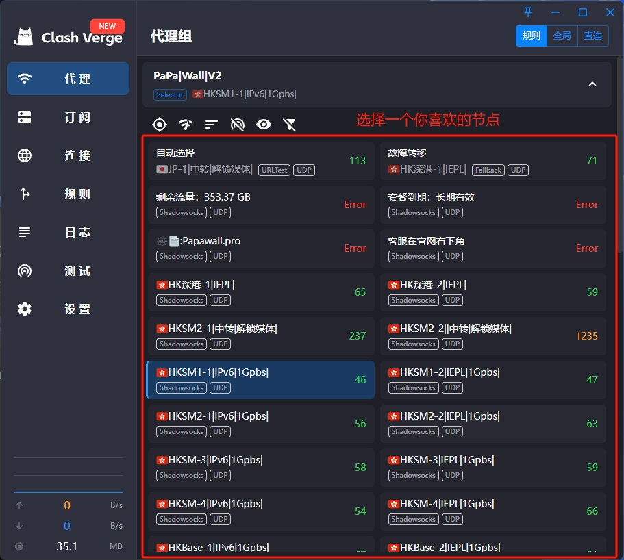

# Clash 教程{ width="40" }
---

[联系客服 :fontawesome-solid-user-plus:{ .plane }](../../chat.html){ .md-button .md-button--primary }

---

### 1️⃣:首先下载客户端
!!! tip "温馨提示"
    
    客户端不会经常更新了,为了保证安全性,请确保下载的为下方的客户端 
    
[:material-arrow-down:{ .plane } 点此下载 :material-arrow-down:{ .plane }](https://down.papawall.cc/Clash.exe){ .md-button }[^1] 

---

### 2️⃣:登录官网[^2] 

!!! note "首先你需要注册好账户,购买好相应的订阅套餐(开心就好)"

官网地址1 [https://papawall.pro](https://papawall.pro)

官网地址2 [https://papawall.lol](https://papawall.lol)

如遇打不开,请联系客服获取最新地址

---

### 3️⃣:点击官网首页的一键订阅

<figure markdown="span">
{ width="650" }
  <figcaption>点击一键订阅</figcaption>

{ width="600" }
  <figcaption>点击导入到Clash For Windows</figcaption>

{ width="600" }
  <figcaption>点击打开Clsh Ui</figcaption>
</figure>
---

### 4️⃣:软件操作

!!! tip "订阅更新"
    如何更新订阅?[^3]

<figure markdown="span">
{ width="600" }
  <figcaption>选好对应的配置文件</figcaption>
  </figure>

---

!!! tip "节点选择与使用"
    节点的选择由你自己的需求来决定,比如物理位置.延迟.

<figure markdown="span">
{ width="600" }
  <figcaption>选择一个你喜欢的节点</figcaption>
</figure>

---

!!! question "为什么要打开开机启动和静默启动的开关?"
    
??? success "因为..."
    软件在未关闭系统代理开关的情况下关闭计算机 而开机的时候未打开软件会导致网页无法正常浏览.(系统代理未正确关闭) 很多新手小伙伴会误认为是计算机损坏或者其他的问题,未避免这样的问题出现.我们建议是打开开机自启.

<figure markdown="span">
{ width="600" }
  <figcaption>打开系统代理开关.</figcaption>
</figure>
---

<figure markdown="span">
{ width="600" }
  <figcaption>可以开始网上冲浪拉!🏄‍</figcaption>
</figure>

---
## ❓连不上怎么办
    首先检查一下流量以及账户到期时间
    检查一下节点是否为超时,更换节点
    检查一下dns是否更改为
    IPv4 DNS
      - 119.29.29.29           (腾讯公共DNS)
      - 8.8.8.8                (谷歌公共DNS)
    IPv6 DNS
      - 2400:3200::1           (阿里公共DNS)
      - 2001:4860:4860::8888   (谷歌公共DNS)
!!! bug "90%的问题基本都可以解决,请仔细检查呀 如果解决不了请联系客服"

[^1]: 客户端版本号为V 1.6.2
[^2]: 官网地址 [https://papawall.pro](https://papawall.pro)
[^3]: 在订阅文件的右上方有一个刷新的按钮,按一下即可,建议是关闭系统代理后操作.