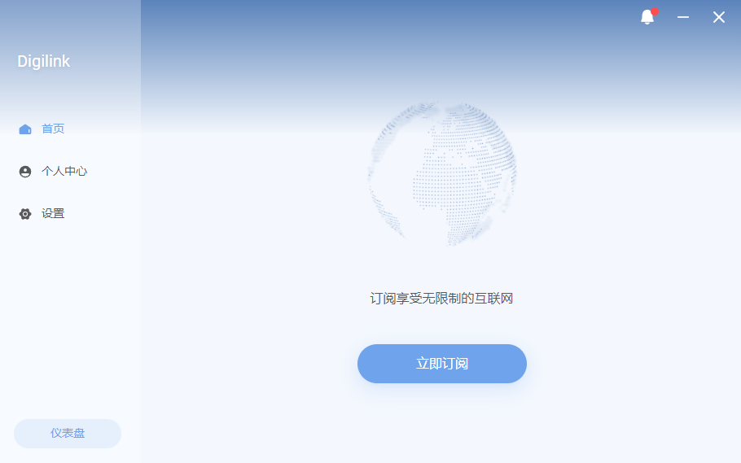
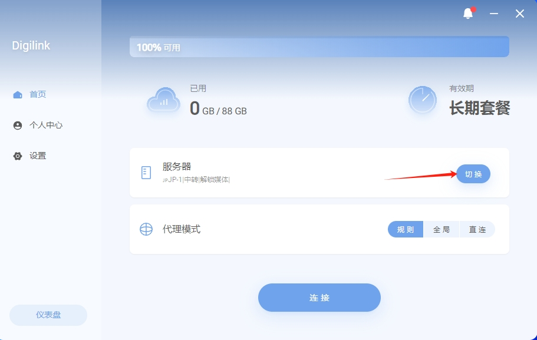
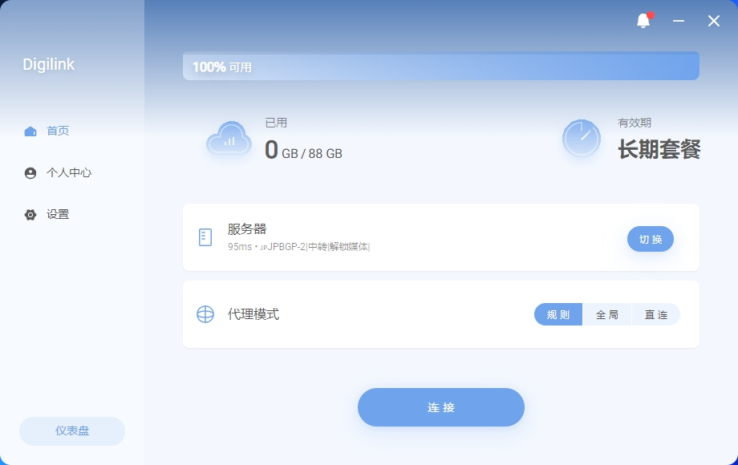

# DigiLink 教程{ width="40" }
---

[联系客服 :fontawesome-solid-user-plus:{ .plane }](../../chat.html){ .md-button .md-button--primary }

---

### 1️⃣:首先下载客户端
!!! tip "温馨提示"
    
    最简单的客户端,只需要在软件里面注册 登录 购买好订阅即可使用.
    
[:material-arrow-down:{ .plane } 点此下载 :material-arrow-down:{ .plane }](http://154.12.60.107:10010/Digilink.exe){ .md-button }[^1] 

---

### 2️⃣:安装客户端
!!! note "安装好客户端以后直接登录,没有账户的注册一下."
<figure markdown="span">
{ width="600" }
  <figcaption>登录你的账户</figcaption>
</figure>

---

!!! note "打开软件进行配置."
    未购买订阅的直接购买好即可

<figure markdown="span">
{ width="600" }
  <figcaption>点击立即订阅</figcaption>
{ width="600" }
  <figcaption>购买你喜欢的订阅套餐</figcaption>
</figure>

---

!!! tip "购买好以后选择一个适合你的节点"

<figure markdown="span">
{ width="600" }
  <figcaption>选择一个适合你的节点</figcaption>
{ width="600" }
  <figcaption></figcaption>
</figure>

---

!!! example "选择好节点后点击连接,就可以出国学习资料啦."

<figure markdown="span">
{ width="600" }
  <figcaption>点击连接</figcaption>
</figure>

---

<figure markdown="span">
{ width="600" }
  <figcaption>可以开始网上冲浪拉!🏄‍</figcaption>
</figure>

---

## ❓连不上怎么办
    首先检查一下流量以及账户到期时间
    检查一下节点是否为超时,更换节点
    检查一下dns是否更改为
    IPv4 DNS
      - 119.29.29.29           (腾讯公共DNS)
      - 8.8.8.8                (谷歌公共DNS)
    IPv6 DNS
      - 2400:3200::1           (阿里公共DNS)
      - 2001:4860:4860::8888   (谷歌公共DNS)
!!! bug "90%的问题基本都可以解决,请仔细检查呀 如果解决不了请联系客服"

[^1]: Digilink的客户端为一体客户端(注册,登录,购买,连接)一般无需更新.