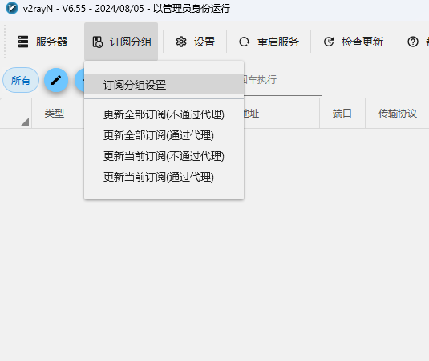
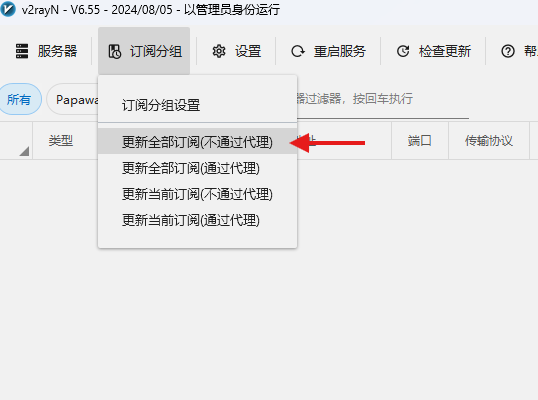
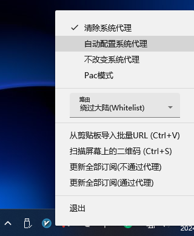

## { width="40" }v2rayN教程
---

[联系客服 :fontawesome-solid-paper-plane:{ .plane }](../../chat.html){ .md-button .md-button--primary }

---

??? tip "温馨提示"
    能使用这个客户端的小伙伴 购买&添加订阅步骤我就不说了
    软件支持支持Xray 核心 v2fly核心  Singbox核心

### 1️⃣.下载客户端

[⏬ 点此下载 ⏬](https://github.com/2dust/v2rayN/releases){ .md-button }[^1] 

---

### 2️⃣.添加订阅&更新订阅获取节点
<figure markdown="span">
{ width="500" }
  <figcaption>点击订阅分组设置</figcaption>
</figure>

!!! tip "建议自动更新时间为360分钟"

<figure markdown="span">
{ width="500" }
  <figcaption>添加订阅 设置自动更新订阅 </figcaption>

{ width="500" }
  <figcaption>点击更新全部订阅(不通过代理)来获取节点 </figcaption>
</figure>

---

!!! tip "右键任意节点 可以进行多项操作 如果要使用节点可以'选择设为活动服务器'"

<figure markdown="span">
{ width="700" }
  <figcaption>右键节点后各项功能的选择菜单 </figcaption>

{ width="300" }
  <figcaption>到桌面右下角右击v2rayN 选择自动配置系统代理 </figcaption>
</figure>

---

<figure markdown="span">
{ width="600" }
  <figcaption>可以开始网上冲浪拉!🏄‍</figcaption>
</figure>

---

## ❓连不上怎么办
    首先检查一下流量以及账户到期时间
    检查一下节点是否为超时,更换节点
    检查一下dns是否更改为
    IPv4 DNS
      - 119.29.29.29           (腾讯公共DNS)
      - 8.8.8.8                (谷歌公共DNS)
    IPv6 DNS
      - 2400:3200::1           (阿里公共DNS)
      - 2001:4860:4860::8888   (谷歌公共DNS)

[^1]: [windows x64] [v2rayN-With-Core.zip 包含所有Core文件];
[v2rayN.zip 不包含Core文件];[zz-v2rayN-With-Core-SelfContained.7z 包含所有Core文件 不需要下载安装Microsoft .NET 8.0 Desktop Runtime];[windows x86] [v2rayN-32.zip 不包含Core文件];[windows arm64][v2rayN-arm64.zip 不包含Core文件]