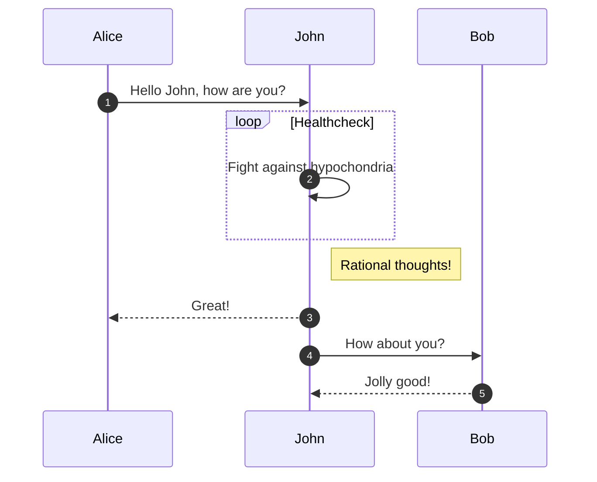
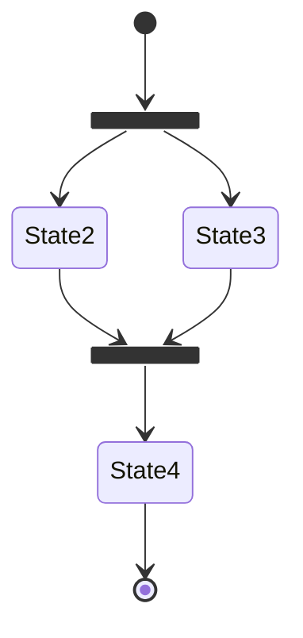
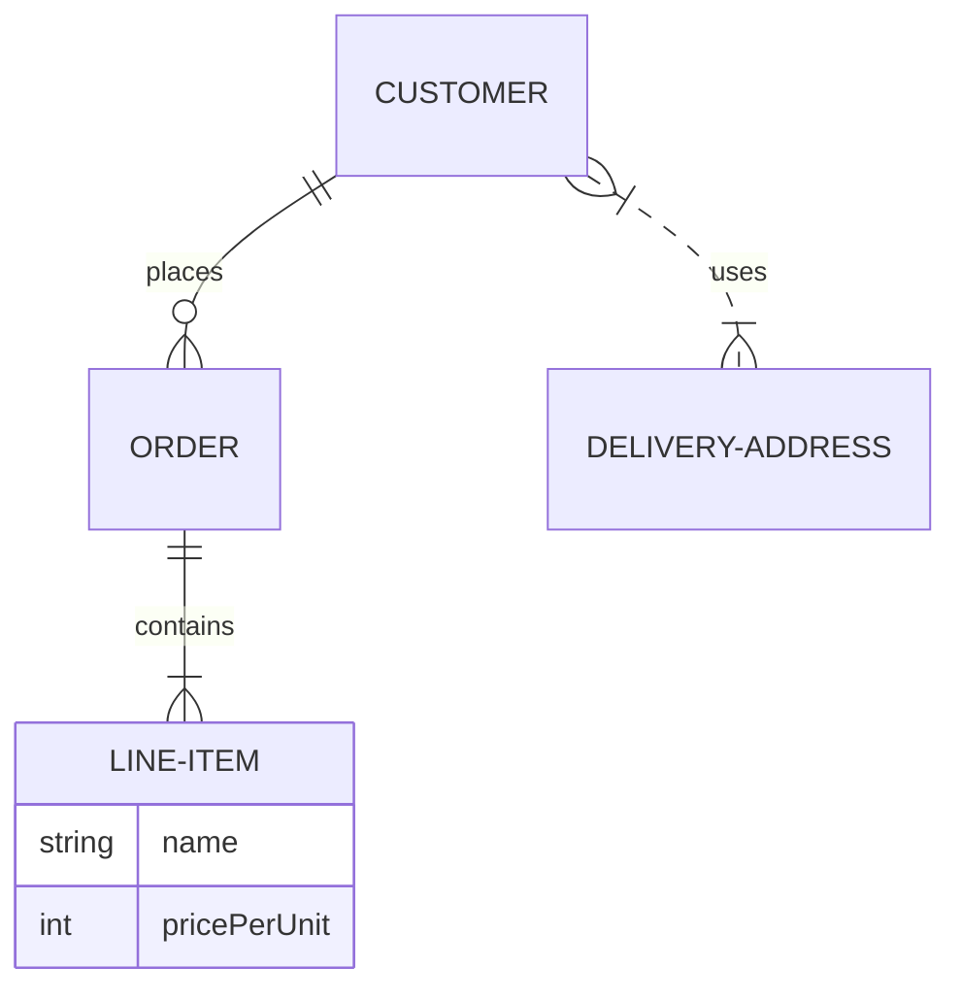

# PaPaDoc 帮助文档

- 记得向你需要的小伙伴分享 [帮助文档](https://docs.papawall.cc).

---

## [点击查看教程](./help/index.md)

<figure markdown="span">
  { width="600" }
  <figcaption>图片测试</figcaption>
</figure>

:smile:
:fontawesome-brands-youtube:{ .youtube }

:octicons-heart-fill-24:{ .heart }

