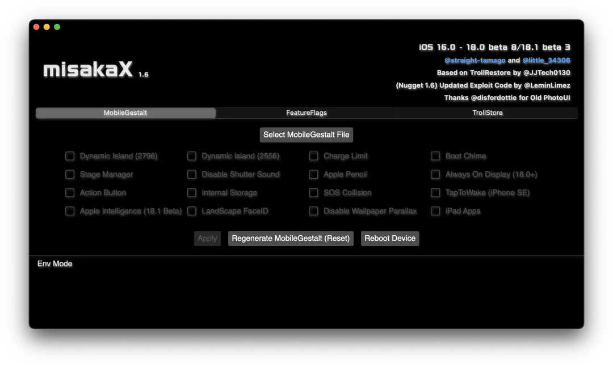
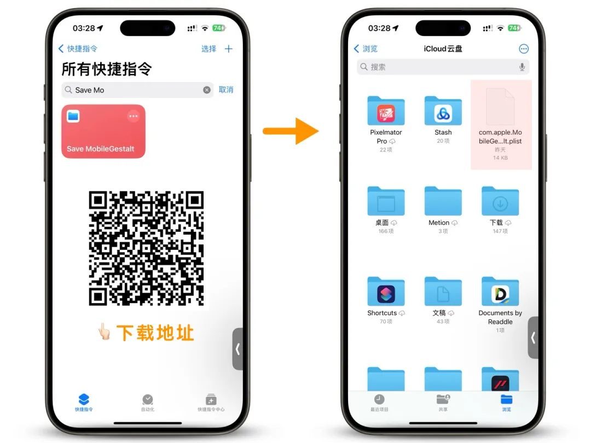
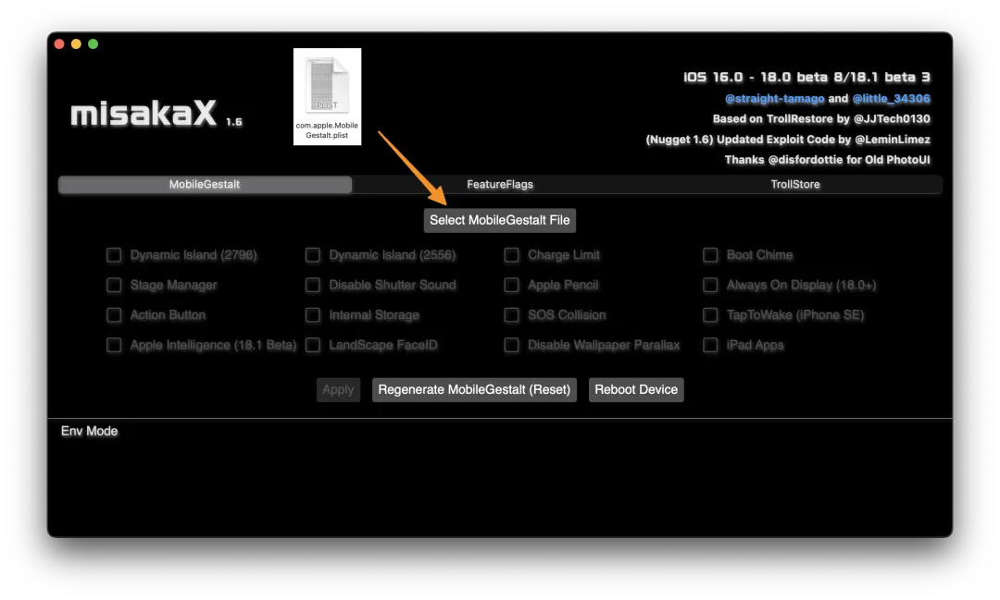
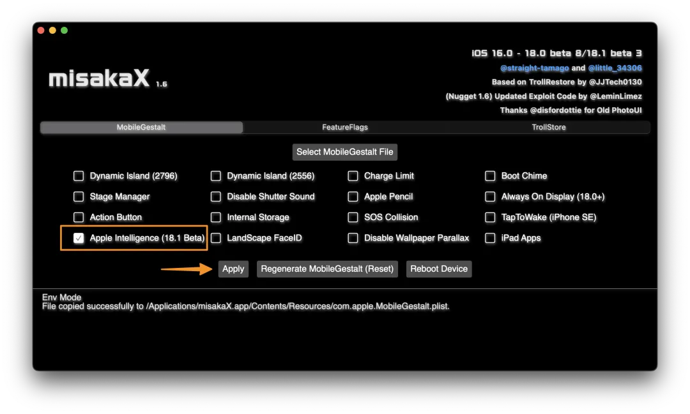
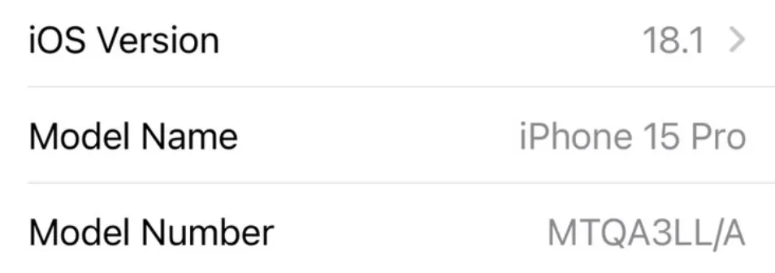

# 👀国行iPhoneAI开启教程
---

<figure markdown="span">
{ width="400" }
  <figcaption></figcaption>
</figure>

!!! note "概要"
    苹果在 iOS 18.1 测试版上正式开启了 Apple Intelligence 的内测，但是欧盟和国行设备因为政策原因不支持， 其中国行更是直接锁硬件。因此理论上只要设备是国行的，无论是修改语言、定位或者网络，均无法开启 Apple Intelligence。

    今天国行 iPhone 15 Pro 的破解教程来了，亲测有效。该方法是一个基于 iOS 还原备份的漏洞，通过此漏洞修改系统的缓存配置文件来实现修改设备销售地区的功能。简单说就是把国行设备改成美版 （后期可以还原） ，这样就可以开启 Apple Intelligence 了。

!!! bug "温馨提示"
    本教程无需清除数据，文末会介绍开启之后的风险，大家可以根据自己情况决定是否实施开启

---
!!! info "准备工作"
    ``` markdown
    1、设备必须是 iPhone 15 Pro、iPhone 15 Pro Max 或即将发布的 iPhone 16 系列
    2、系统必须是 iOS 18.1 （含测试版） 及其以上，因为该版本才新增 Apple Intelligence，正式版预计要等到十月中旬
    3、提前准备好一个美区 Apple ID，可以联系客服购买.
    4、在 iPhone 设备上提前关闭定位查找我的 iPhone
    5、一台 Mac 或者 Windows 电脑
    ```

以上准备工作，缺一不可。理论上国行 M1 芯片及其以上的 iPad 也是可以通过该教程开启的。

---
### 1️⃣ 下载工具"MisakaX" 需要魔法🧙‍♀️
[:material-arrow-down:{ .plane } 点此下载 :material-arrow-down:{ .plane }](https://github.com/straight-tamago/misakaX/releases){ .md-button }

<figure markdown="span">

  <figcaption>Mac 版和 Windows 版其中 Windows 版需要电脑上安装 iTunes。</figcaption>
</figure>
<figure markdown="span">

  <figcaption>打开以后是这样的</figcaption>
</figure>

#### 打开后点一下安装 PyMobileDevice 的按钮，然后把你的 iPhone / iPad 连接到电脑。
#### 注意：如果你的电脑上已经安装了 PyMobileDevice 且正确设置了环境变量可以不用装它的。

---
### 2️⃣ 用 iOS 快捷指令获取 iPhone 配置文件：
### 直接扫码下载
!!! tip "运行指令之后，配置文件保存在 iCloud 云盘，或者其他办法导入到 Mac 或 Windows 电脑上。"
    每个手机代码不一样,只能自己使用自己的配置文件
<figure markdown="span">

  <figcaption>扫码添加快捷指令</figcaption>
</figure>


---

### 3️⃣ iPhone 连上电脑，MisakaX 上导入配置文件：
!!! tip "点击Select MobileGestalt File 把配置文件拖进去."
<figure markdown="span">

  <figcaption></figcaption>
</figure>

!!! tip "勾选 Apple Intelligence （iOS 18.1 beta），然后点击 Apply（应用）"
<figure markdown="span">

  <figcaption></figcaption>
</figure>
!!! quote "设置期间会询问你是否要启用 Apple Intelligence，请选择是，一般加入 Wishlist 之后十几分钟即可使用。"
!!! warning "此时你的设备应该会重新启动。设备重启后，有一个欢迎界面，按照指引完成设置，语言为英文，地区为美国(United States)。在出现你的 Apple ID 头像并询问你的偏好设置的时候，请选择 Customize，并在 Apps & Data 页面选择 "Don't Transfer Apps & Data"。注意：如果你选择了从 iCloud 恢复，请立即按一下 音量 + ，再按一下 音量 - ，然后按住 侧边按钮 进行重启，然后重新设置。"
---
!!! tip "在完成设置向导后，将你的 iPhone 连接到充电器，并保持连接到 Wi-Fi，iOS 会在后台自动下载 Apple Intelligence 所需的模型文件。当下载完毕之后，你将会收到通知。"
<figure markdown="span">
{ width="450" }
  <figcaption></figcaption>
</figure>

!!! tip "这时候如果你在关于本机查看，就会发现版本已经变成了 LL/A 结尾的美版 iPhone 了。于是乎，这样就带来了这个教程的风险："
<figure markdown="span">

  <figcaption></figcaption>
</figure>
<figure markdown="span">

  <figcaption></figcaption>
</figure>
---

!!! success "目前 iOS 18.1 的 Apple Intelligence 还不够完善，许多涉及到总结改写的文字功能都只支持英文，包括 ChatGPT 集成和表情创建等功能还未上线测试，目前唯一无障碍使用的大概就是就是照片清除功能了："
<figure markdown="span">

  <figcaption></figcaption>
</figure>

!!! bug "总的来说这个教程很干货，但客观来说有一定门槛，如果你英文较好喜欢尝鲜 Apple Intelligence，且可以承担一定的风险，那么确实可以按照上述教程试试。但大部分人应该会在试用之后不久，就会切换回原来状态，毕竟 Apple Intelligence 目前不支持中文，功能也确实还不够完善。"